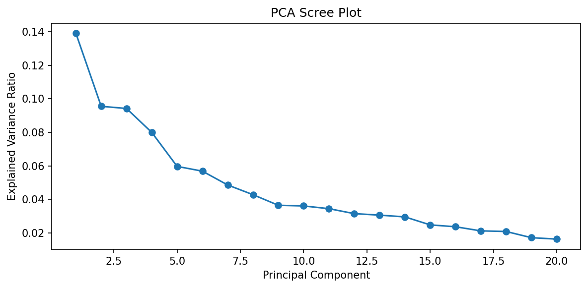
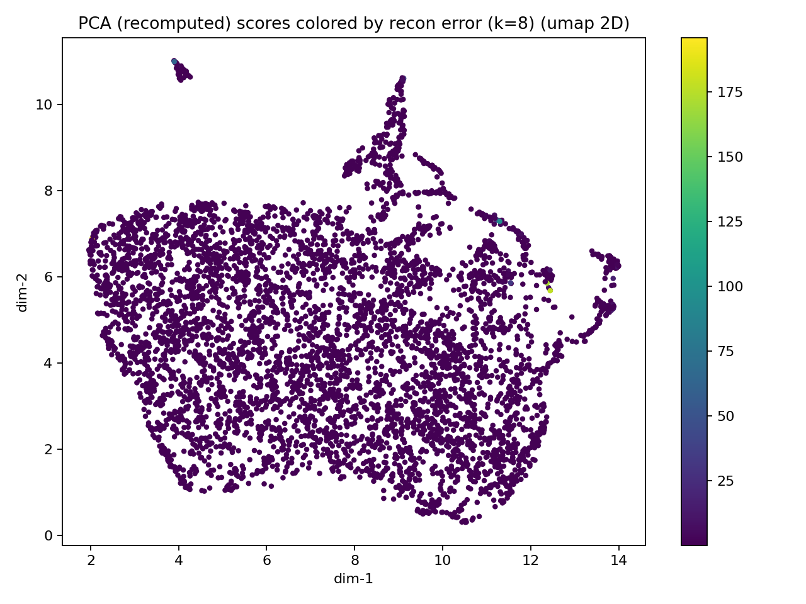
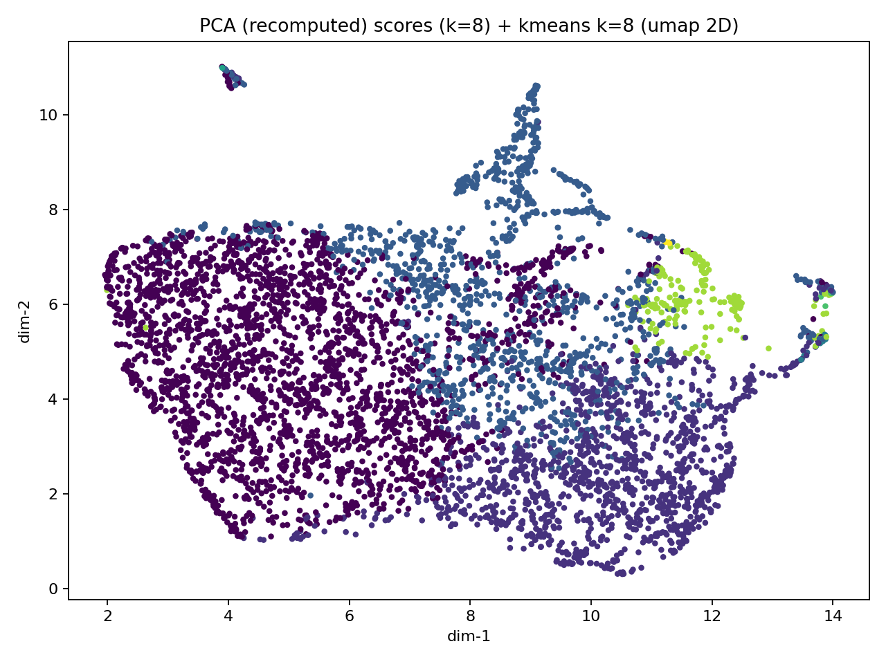
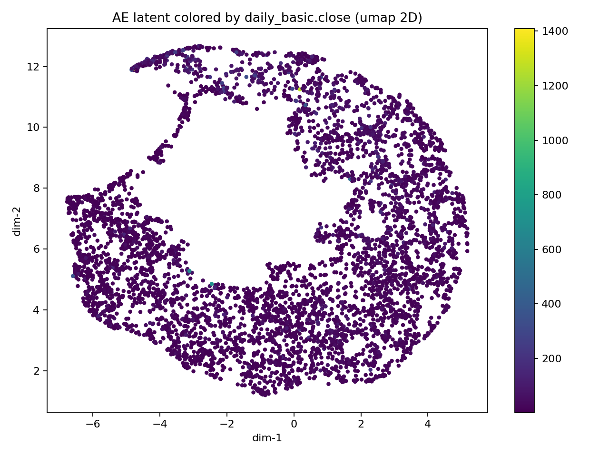
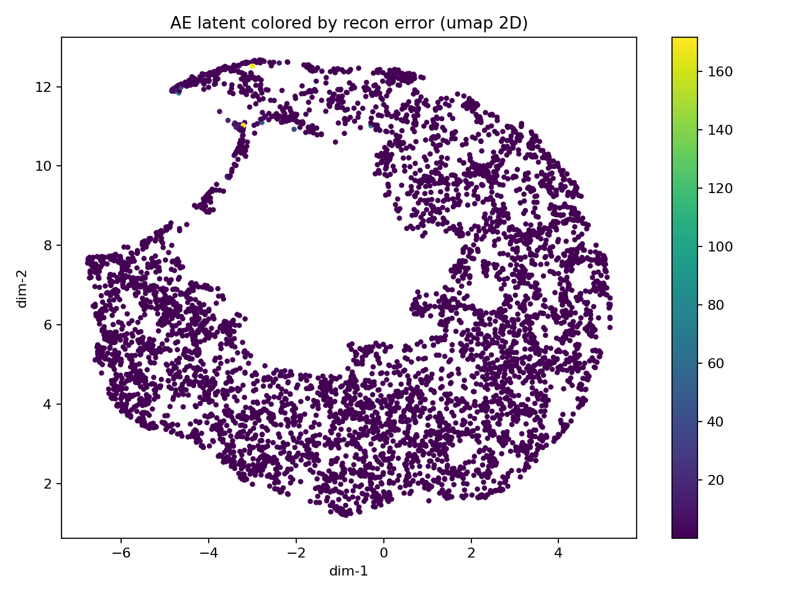

# 因子分析筛选器：基于深度学习的股票结构探索

> **声明**：本项目仅用于学术研究与数据分析展示，不构成任何形式的量化投资建议或交易指导。
>
> 项目网站：https://github.com/vanadiumD/stock-factor-analysis

---

## 一、项目简介

本项目是一个**因子分析与结构化筛选工具**，目标不是直接预测股票涨跌，而是：

- 在**单一交易日的横截面**上，整合上百个基本面与财务因子
- 通过 **统计清洗 + PCA + 自编码器（AutoEncoder）** 压缩高维因子空间
- 使用 **聚类与潜在空间分析**，发现一些在结构上“有特点”的股票组合

你可以把它理解为：

> **不是选“好股票”，而是找“在因子结构上很不一样的股票”。**

---

## 二、项目结构（基于根目录）

```
.
├── factor/
│   ├── fetch_a_tushare.py        # 使用 Tushare 拉取A股因子数据
│   ├── preanalysis.py            # 因子预分析与清洗（hist / 相关性 / PCA）
│   └── purified.h5               # 预处理后的因子数据（自动生成）
├── ae_cluster.py             # AutoEncoder 训练 + 聚类分析
├── ae_extra_analysis.py      # 基于潜在空间的股票筛选
├── run.sh                      # 服务器端一键运行示例
├── requirements.txt              # Python 依赖
├── .env                          # Tushare API Key（需自行配置）
└── README.md
```

---

## 三、环境配置与依赖安装

### 1. 安装依赖

在**项目根目录**下执行：

```bash
pip install -r requirements.txt
```

### 2. 配置 Tushare API Key

1. 访问 https://tushare.pro/ 注册账号
2. 在个人主页获取 `API Token`
3. 在项目根目录新建 `.env` 文件，内容如下：

```env
TUSHARE_KEY=your_tushare_token_here
```

> 注意：需要一定积分才能访问完整的财务与因子接口

---

## 四、数据获取：因子与行情下载

### 1. 本地运行（推荐）

```bash
python .\factor\fetch_a_tushare.py
```

- 默认获取**最近一个交易日**的数据
- A股约 **5000+ 支股票**
- 包含：
  - daily_basic（日频行情）
  - financials（财务与基本面因子，100+）

### 2. 服务器运行（示例）

```bash
bash run.sh
```

或后台运行：

```bash
nohup python factor/fetch_a_tushare.py > fetch.log 2>&1 &
```

### 3. 关于时间

- 实盘数据：**工作日 15:00 后更新**
- 文档示例统一使用：`20251219`

---

## 五、因子预分析与清洗（核心步骤）

```bash
python .\factor\preanalysis.py --date 20251219
```

若不指定 `--date`，默认使用**当天日期**。

### 1. 预分析流程概览

1. 因子直方图（Histogram）
2. 因子质量审计（缺失 / 零值 / 唯一性）
3. 相关性分析（Pearson / 其他方法）
4. 连通图剪枝（Connected Components）
5. PCA 初步降维分析

---

### 2. 关键统计指标解释

在预分析过程中，每个因子都会被计算如下指标：

| 指标名 | 含义 |
|------|------|
| `valid_ratio` | 非 NaN 的比例 |
| `nan_ratio` | 缺失值比例（=1-valid_ratio） |
| `zero_ratio` | 在有效值中为 0 的比例 |
| `zero_all_ratio` | 在全样本中为 0 的比例 |
| `unique_count` | 非重复取值数 |

这些指标用于判断：

- 因子是否“几乎全是缺失”
- 是否是“常数因子 / 离散因子”
- 是否信息量过低

---

### 3. 直方图交互删除（Histogram Prune）

在绘制完 hist 后，终端支持交互式输入：

示例命令：

```
null=10            # 删除缺失率最高的10个因子
zero=5             # 删除零值最多的5个因子
nan>=0.8           # 删除 nan_ratio ≥ 0.8 的因子
valid<=0.2         # 删除有效率 ≤ 20% 的因子
3, roe, pb         # 按序号或名称手动删除
```

<p align="center">
  
</p>

---
### 4. 相关性剪枝（Connected Components）

不同于“相关次数排序”，本项目采用：

- 构建 **因子相关图**
- 找 **连通分量（Connected Components）**
- 每个分量只保留一个“质量最好”的因子

交互命令示例：

```
cc=3      # 剪掉前3个最大连通分量中的冗余因子
cc=all    # 对所有连通分量执行剪枝
```

因子“质量评分”综合考虑：

- valid_ratio 高
- zero_all_ratio 低
- unique_count 高

<p align="center">
  
</p>

删去相关性连通图其他成分后的结果

---

### 5. 预分析输出结果

- 剩余因子列表：

```
factor/remaining_factors_20251219.json
```
因子从最开始的一百多个压缩到27个有效因子
- PCA 结果文件：

```
factor/pca_summary_20251219.csv
factor/pca_loadings_20251219.csv
factor/pca_scores_20251219.csv
factor/pca_scree_20251219.png

```
## PCA 解释方差分析

下表给出了因子在 PCA 分解后的解释方差比例及其累计值，可以看到前若干主成分已经覆盖了大部分横截面信息。

| PC   | Explained Variance Ratio | Cumulative Explained Variance |
|------|--------------------------|--------------------------------|
| PC1  | 0.1391                   | 0.1391                         |
| PC2  | 0.0956                   | 0.2347                         |
| PC3  | 0.0943                   | 0.3289                         |
| PC4  | 0.0800                   | 0.4089                         |
| PC5  | 0.0597                   | 0.4686                         |
| PC6  | 0.0569                   | 0.5254                         |
| PC7  | 0.0486                   | 0.5740                         |
| PC8  | 0.0428                   | 0.6168                         |
| PC9  | 0.0365                   | 0.6533                         |
| PC10 | 0.0361                   | 0.6894                         |

从 PCA 的累计解释方差可以看到：

- 前 8 个主成分已解释约 **61.7%** 的总方差
- 在 PC8 之后，边际信息增量明显下降

因此在后续 AutoEncoder 训练中，将潜在维度设置为 **8**，作为在信息保留与模型复杂度之间的折中选择。

<p align="center">
  
</p>


> **此处 PCA 的累计解释方差可作为后续 Encoder 维度选择的重要参考**


---

## 六、AutoEncoder 训练与聚类分析

```bash
python .\ae_cluster.py --date 20251219
```

### 1. Encoder 维度设置

在 `ae_cluster.py` 中修改：

```python
LATENT_DIM = 8   # 常用范围：4 ~ 10
```

该维度通常参考：

- PCA 累计解释方差拐点
- 因子数量规模

---

### 2. 模型流程

1. 因子标准化
2. AutoEncoder 重构训练
3. 获取潜在表示（latent space）
4. 在 latent 上做 KMeans / GMM 聚类

---

### 3. 主要输出

```
factor/ae_out_20251219/
├── ae_latent.csv                 # 每只股票的潜在向量
├── ae_model.pt                   # 训练好的模型
├── clusters_AE_*.csv             # 聚类标签
├── latent_cluster_*.png          # 聚类可视化
└── latent_recon_error_*.png      # 重构误差分布
```

## 聚类与潜在空间可视化（UMAP 2D）

本节展示 PCA(k=8) 与 AE(latent=8d) 的二维嵌入（UMAP），以及在该空间下的聚类结果与重构误差分布。
需要强调：UMAP 仅用于可视化，不改变原始聚类是在 8 维空间（PCA/AE latent）中完成的事实。

---

### 1) PCA(k=8) 重构误差分布（颜色=重构误差）

这张图把 **PCA(8维) 的样本重构误差**映射到 UMAP 2D 上，颜色越亮表示该股票在 PCA 线性子空间中越难被重构，
通常意味着该股票在“线性主成分”刻画下属于结构异常或非线性特征更强的样本（可能是离群、极端财务画像、或数据噪声更大）。

<p align="center">
  
</p>

**阅读要点：**
- 大部分点颜色较暗：说明多数股票可被 PCA 的线性 8 维子空间较好重构
- 少量高亮点/局部区域：代表 PCA 难以解释的结构，后续可作为“异常结构候选”进一步查看

---

### 2) PCA(k=8) + KMeans(k=8) 聚类（颜色=聚类标签）

该图展示在 **PCA scores (k=8)** 上进行 KMeans(k=8) 得到的聚类标签，并投影到 UMAP 2D。
可以观察到 PCA 的聚类往往呈现“软边界”或“混合带”，说明线性表示下类别间的可分性有限。

<p align="center">
  
</p>

**阅读要点：**
- 若不同颜色大量交叠，意味着 PCA 表示下聚类边界并不清晰
- 这类结果对应指标上常见：Silhouette 偏低、DB 偏高

---

### 3) AE(latent=8d) + KMeans(k=8) 聚类（颜色=聚类标签）

该图展示在 **AE latent (8维)** 上进行 KMeans(k=8) 的聚类标签，并投影到 UMAP 2D。
通常会看到更清晰的“团块/带状结构”，说明 AE 的非线性压缩更容易把不同结构类型的股票分开。

<p align="center">
  
</p>

**阅读要点：**
- 聚类边界更清晰：不同颜色区域更集中、重叠更少
- 对应指标改善：Silhouette/CH 上升、DB 下降（你的结果里 AE 明显优于 PCA）

---

### 4) AE(latent=8d) 颜色映射：daily_basic.close（颜色=收盘价）

该图用 AE 潜在空间作为“结构坐标系”，并用收盘价进行着色。
如果出现明显的颜色梯度或局部高价/低价聚集，说明 AE 空间中存在与价格相关的结构方向；
反之若颜色基本随机，说明价格并不是该结构空间的主导解释变量。

<p align="center">
  
</p>

**阅读要点：**
- 颜色呈现连续梯度：可能存在“规模/价格层次”类结构因素（但不等于可交易信号）
- 颜色高度混杂：说明 close 与该潜在结构的相关性弱，更像是独立属性

---

### 5) AE(latent=8d) 重构误差分布（颜色=重构误差）

该图将 **AE 的重构误差**映射到 UMAP 2D。
高误差点通常表示：该股票的因子组合模式较“稀有”，或者存在异常值/缺失填充影响，
因此可作为“结构性异常样本”进入后续的人工核查清单。

<p align="center">
  
</p>

**阅读要点：**
- AE 重构误差并非越小越好：高误差点往往是“有特点”的候选
- 可结合 extra_analysis 输出（代表点/极值点）交叉验证，提高可解释性

---


## AE 与 PCA 的结构表现对比

| Method | recon_mse_mean ↓ | recon_mse_p90 ↓ | silhouette ↑ | calinski_harabasz ↑ | davies_bouldin ↓ |
|--------|------------------|------------------|--------------|----------------------|------------------|
| AE     | 0.481346         | 0.316964         | **0.404287** | **3412.68**          | **0.805095**     |
| PCA    | 0.573186         | 0.269668         | 0.197131     | 601.84               | 1.247439         |

从结果可以看到，尽管 PCA 在重构误差的 p90 分位上略优于 AE，但在整体结构刻画能力上明显受限。
PCA 作为线性方法，主要保留全局方差信息，其低维表示更倾向于压缩均值附近的变化，
导致在聚类空间中不同股票之间的分离度较低。

相比之下，AutoEncoder 能够捕捉因子之间的非线性关系，在保持较低平均重构误差的同时，
显著提升了潜在空间中的结构可分性。AE 在 Silhouette 与 Calinski–Harabasz 指标上的提升，
表明不同结构类型的股票在潜在空间中被更清晰地分离；Davies–Bouldin 指标的降低，
则说明各聚类内部更加紧致、噪声干扰更少。

结合 PCA 的累计解释方差结果可以发现，前 8 个主成分仅能解释约 62% 的总体变异，
而 AE 在相同维度下仍能形成更清晰的结构划分。
这说明 AE 并非单纯地进行信息压缩，而是在低维空间中重构了更有判别力的因子表示。

---

## 七、潜在空间的“有趣股票”筛选

```bash
python .\ae_extra_analysis.py --date 20251219
```

该步骤**不预测收益**，只做结构探索。

### 1. 两类筛选逻辑

#### （1）聚类代表点

- 每个 cluster 中
- 选取距离中心最近的 N 只股票

代表“该结构的典型形态”。

#### （2）潜在维度极值

- 对每一个 latent 维度
- 选取 Top-N / Bottom-N 股票

代表“在某种抽象因子方向上极端”的股票。

---

### 2. 输出文件

```
factor/ae_out_20251219/extra_pick_simple/
├── picks_cluster_representatives_n10.csv
├── picks_latent_extremes_n10.csv
├── picks_all.csv
└── plot_latent2_highlight_all.png
```
<p align="center">
  
</p>

---

## 八、整体分析报告与主要发现（示例）

完整流程中会生成并对比以下图像与结果：

1. **所有因子的直方图分布**（异常 / 偏态 / 常数）
2. **初始相关性图 vs 清洗后的相关性图**
3. **PCA Scree Plot 与累计解释方差**
4. **PCA 空间下的聚类分布**
5. **AutoEncoder 潜在空间 vs PCA 的结构对比**
6. **潜在空间中被高亮的“结构性股票组合”**

核心发现通常包括：

- 某些财务因子在横截面上几乎退化
- 高度相关的因子组往往来自同一财务逻辑
- AE 在非线性结构上可分离 PCA 难以区分的股票
- 极端 latent 股票往往具有明显的财务画像差异

---

## 九、总结

这个项目不是一个“直接赚钱”的工具，而是：

- 一个**因子结构显微镜**
- 一个**深度学习辅助的探索平台**
- 一个可以持续扩展到多期、多市场的分析框架

如果你想在“因子很多、逻辑很杂”的情况下，

> **先搞清楚结构，再谈建模**，

---

**再次强调：本项目不构成任何投资建议。**


